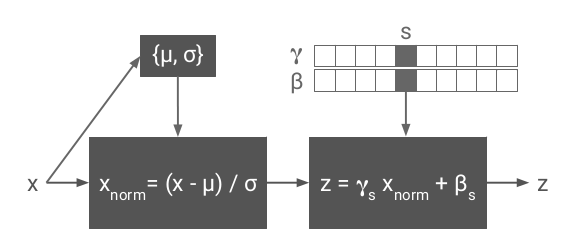
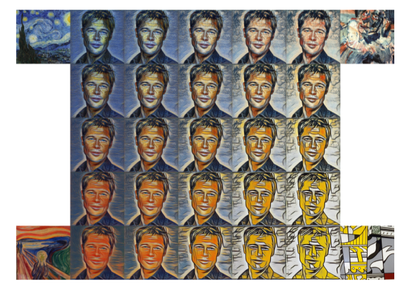
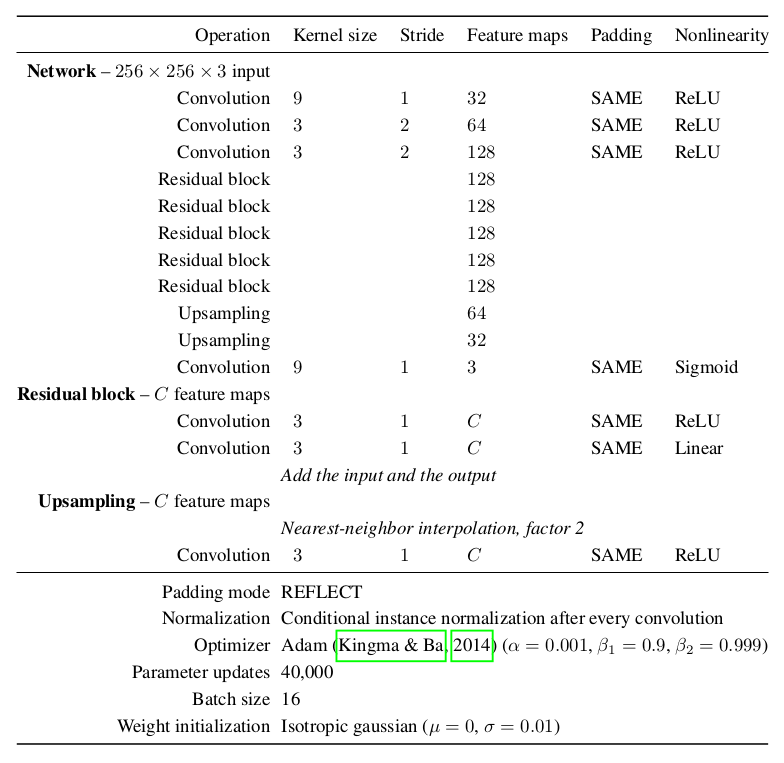

# Information
* Paper: [A Learned Representation For Artistic Style](https://arxiv.org/pdf/1610.07629v3.pdf)
* Author: Vincent Dumoulin, Jonathon Shlens, Manjunath Kudlur
* Implementation: [tensorflow](https://github.com/tensorflow/magenta/tree/master/magenta/models/image_stylization)

# Summary
* what:
  * They proposed a modification to the previous style transfer network, namely the _conditional instance normalization_.
  * By the proposed technique, a style transfer network can learn multiple styles at the same time.
* how:
  * The structure of the style transfer net is the same as this [perceptual loss paper](Perceptual_Losses_for_Style_Transfer_and_Super_Resolution.md). Hyper-parameters can be found in the table below.
  * They modify the [instance normalization](Instance_Normalization.md) method by adding a shifting variable(`shif_v`) and a scaling variable(`scal_v`). Then when doing the normalization after convolution, for each activation `out = (in - mean) / std * scal_v + shif_v`
     
  * Only about 3K parameters is used to specify an individual style.  

* results:
  * They claimed that the single-style output of N-Style network is comparable to the 1-Style network
  * They claimed that the the convergence speed of N-Style network is a little slower than the 1-Style network. However, the final loss is similar.

* Outputs of N-Style Network

* important details:
* Hyper Parameters Table

# Page-by-Page walk-through

# Test Results
* cannot train from magenta
