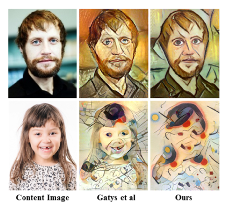
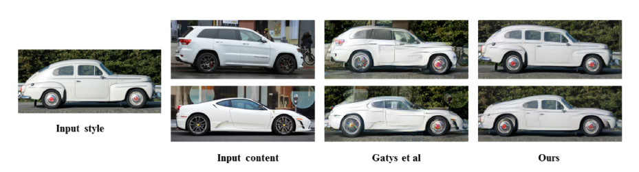

# Information

* Paper: [Combining Markov Random Fields and Convolutional Neural Networks for Image Synthesis](http://arxiv.org/abs/1601.04589)
* Author: Chuan Li, Michael Wand
* Implementation: [torch](https://github.com/chuanli11/CNNMRF), [tensorflow](https://github.com/awentzonline/image-analogies)

# Summary

* What
  * They introduce a method which can transfer the style of the source image to the target image.
  * The main advantage of their method compared to the well-known [style-transfer algorithm](A_Neural_Algorithm_for_Artistic_Style.md) is that their results have less artifacts when the source image and target image share similar structures. Their method performs much better on photo-realistic style transfer

* How
  * content-loss:
    * refer to [artistic style paper](A_Neural_Algorithm_for_Artistic_Style.md).
  * style-loss:
    * They replace the original style loss with a MRF based style loss.
      * Step 1: Feed the source image into the pre-trained network(VGG-19) and select activations set `r_s` from a certain hidden layers(eg: `relu3_1`)
      * Step 2: Perform Step 1 analogously for target image. We get `r_t`
      * Step 3: Extract `m` `k x k x C` patches from `r_s`. We get patch set `p_s`
      * Step 4: Extract `m` `k x k x C` patches from `r_t`. We get patch set `p_t`
      * Step 5: For each patch in `p_t`, find the nearest neighbor in set `p_s`, calculate the squared error of each pair.
      * Step 6: Sum up the error for all patches in `p_t`

  * regularizer-loss:
    * The loss encourages smooth transitions in the synthesized image (i.e. few edges, corners).
    * It is based on the raw pixel values of the last synthesized image.
    * For each pixel in the synthesized image, they calculate the squared x-gradient and the squared y-gradient and then add both.
    * They use the sum of all those values as their loss (i.e. `regularizer loss = <sum over all pixels> x-gradient^2 + y-gradient^2`).
  * The total loss is the weighted sum of the three kinds of losses

* Results
  * In comparison to the original artistic style paper:
    * Less artifacts.
    * Their method tends to preserve style better, but content worse.
    * Can handle photorealistic style transfer better, so long as the images are similar enough. If no good matches between patches can be found, their method performs worse.

* Non-photorealistic example images. Their method vs. the one from the original artistic style paper.

* Photorealistic example images. Their method vs. the one from the original artistic style paper.

* important details:
  * They start their synthesis with a low resolution image and then progressively increase the resolution (each time performing some iterations of optimization).
  * They sample patches from the style image under several different rotations {-30, -15, 0, 15, 30} and scalings{0.85, 0.9, 0.95, 1, 1.05, 1.1, 1.15}.
  * They use layer relu4_2 to calculate content loss and relu3_1 and relu3_2 to calculate style loss.
  * They use stride 1 and filter size [3, 3] for patch sampling(a very dense sampling)
  * They use an additional convolutional layer for computing style loss. Patches from the style images are treated as filters. The best matching patches will give the maximum response(Tricky Part)

# Page-by-Page walk-through

# Test Result
