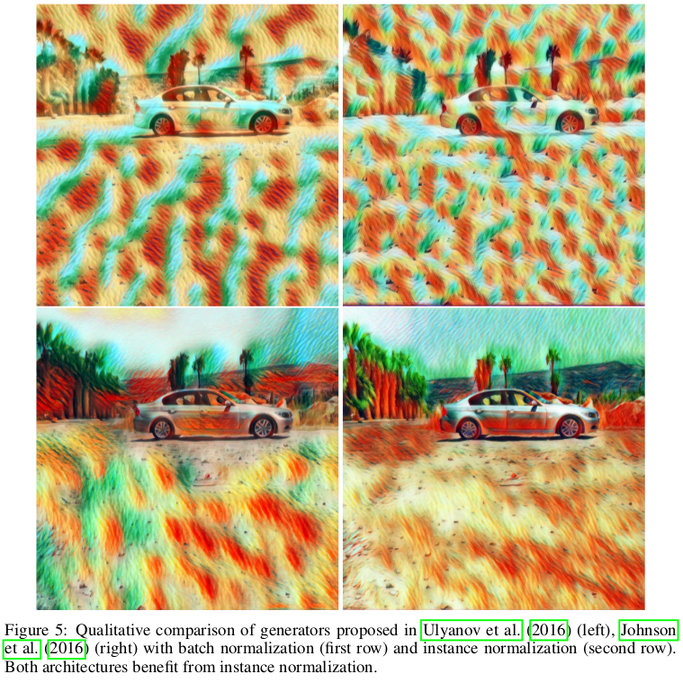

# Information
* Paper: [Instance Normalization: The Missing Ingredient for Fast Stylization](https://arxiv.org/pdf/1610.07629v3.pdf)
* Author: Dmitry Ulyanov, Andrea Vedaldi, Victor Lempitsky
* Implementation: [torch](https://github.com/DmitryUlyanov/texture_nets)

# Summary
* what:
  * They proposed a method, namely _instance normalization_.
  * They found that replacing _batch normalization_ with _instance normalization_ will dramatically increase the quality of output image and decrease the difficulties for training.
* how:
  * A very simple idea from contrast normalization
  * Let `x` be an activation, we can calculate the mean `m` and standard deviation `std` of `x`. Then we calculate `out_x = (x - m) / std `
  * Note that for _batch normalization_, we use all image in the batch to calculate the mean and standard deviation
* results:
* A comparison between 4 method

