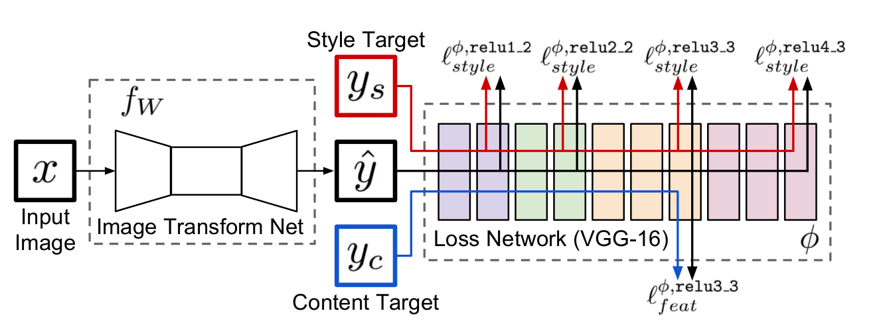
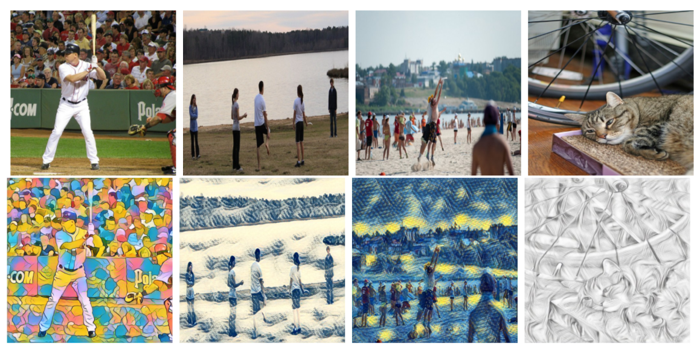
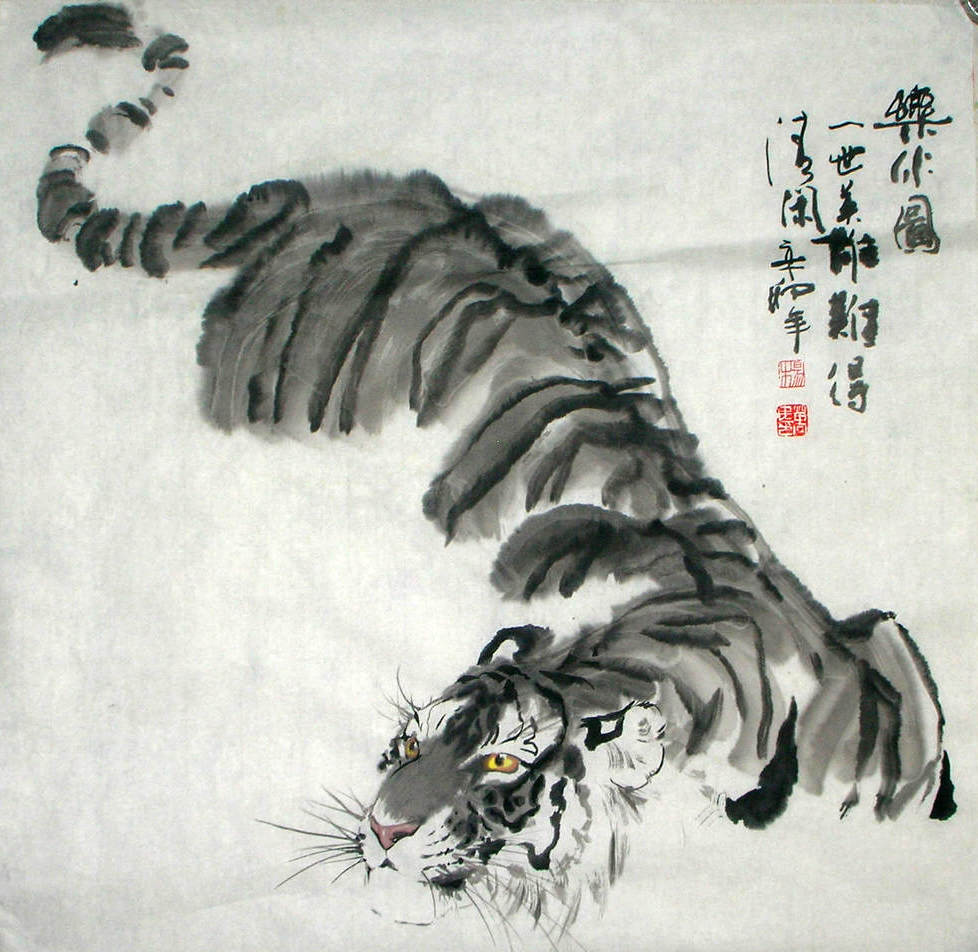

# Information 
* Paper: [Perceptual Losses for Real-Time Style Transfer and Super-Resolution](https://arxiv.org/pdf/1603.08155v1.pdf)
* Author: Justin Johnson, Alexandre Alahi, Li Fei-Fei
* Implementation: [torch](https://github.com/jcjohnson/fast-neural-style), [tensorflow](https://github.com/lengstrom/fast-style-transfer)

# Summary 
* What:
  * Combining the advantages of feed-forward NN (per-pixel loss) method and optimization-based method (perceptual loss) method. Their network can get a comparable result to optimization-based method in real-time.
* How: 
  * Two basic components: image transformation network and loss network 
  * Image transformation networks： follow the architectural guidelines of DCGAN 
    * For style transfer: A convolutional layer with stride 1, Two convolutional layer with stride 2, 
    Five residual blocks, Two convolutional layers with stride 1/2. More details can be found in the [supplementary matirials](http://cs.stanford.edu/people/jcjohns/papers/eccv16/JohnsonECCV16Supplementary.pdf)   
    * Why using stride 2 to resize the image:  fast computing and larger respective field size  
  * Loss Network
    * A pre-trained VGG-16 network on imageNet dataset.
    * Feature Reconstruction Loss: Average Euclidean distance between feature representations of content image and output image.
    * Style Reconstruction Loss: Euclidean distance between Gram Matrix of style image and output image. 
    * How to calculate Gram matrix: 
      * The size of gram matrix is [C * C]. C is the channel number of j th layer. 
      * Take the activations at j th layer and reshape it as one-dimension vector
      * Take pairs of activations from style image and output image, performs scalar product and sum it up as an element of gram matrix. 
    * The total loss is a weighted sum of content and style losses of selected layers.
    * The total loss is regularized by total variation regularizer

   
* result: 
  

* important details: 
  * using ReLU non-linearity 
  * batch normalization after every convolutional layer
  * optimization method: L-BFGS
  * Trained on MS COCO dataset resized to 256 * 256 (80K training images) 
  * Feature loss: relu2_2, Style loss: relu1_2， relu2_2, relu3_3, relu4_3

# Page-by-Page walk-through 

# Test Result

* Some test result on Chinese-Painting style 

