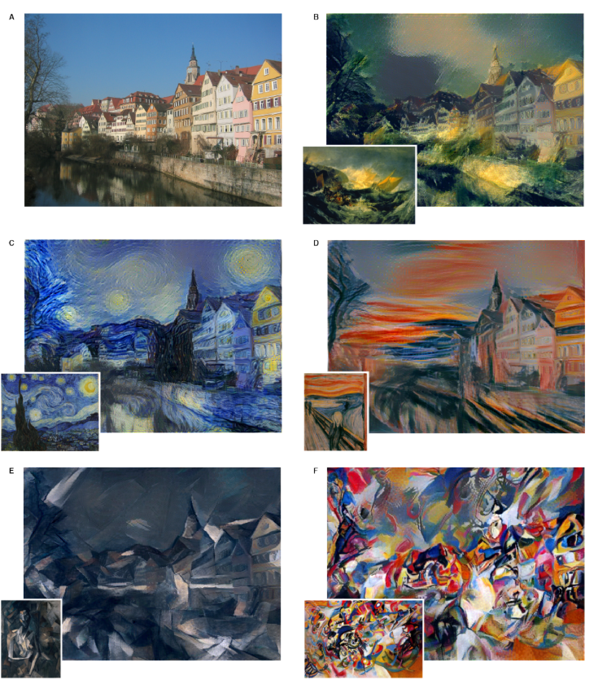
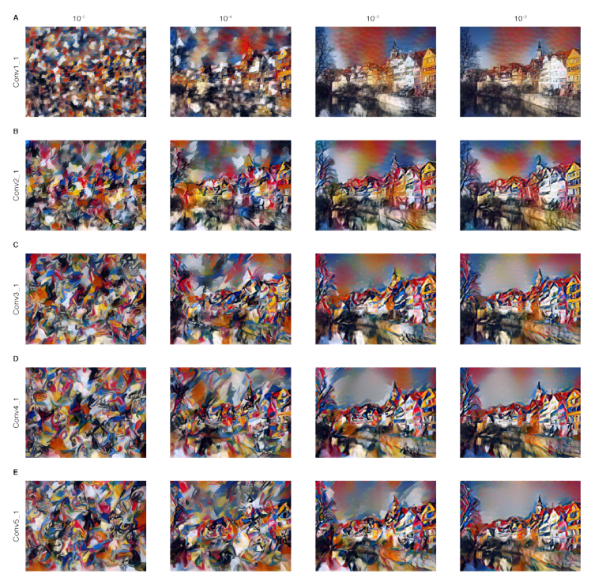

# Information
* Paper: [Texture Networks: Feed-forward Synthesis of Textures and Stylized Images](https://arxiv.org/pdf/1603.03417v1.pdf)
* Author: Dmitry Ulyanov, Vadim Lebedev, Andrea Vedaldi, Victor Lempitsky
* Implementation: [tensorflow](https://github.com/ProofByConstruction/texture-networks)(have not tested yet), [torch](https://github.com/DmitryUlyanov/texture_nets)
# Summary
* what:
* how:
* results:
  * Different Styles
  <!--  -->
  * Different parameters
  <!--  -->
* important details:
  * They replaced max pooling with average pooling
# Page-by-Page walk-through
# Test Results of Chinese Painting Style
