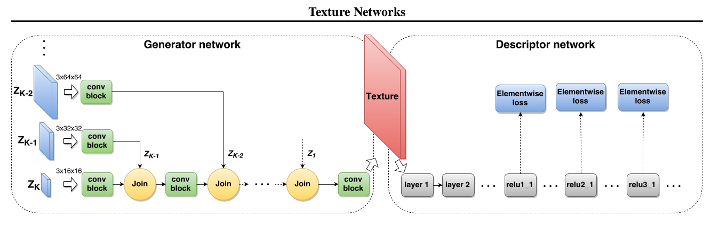
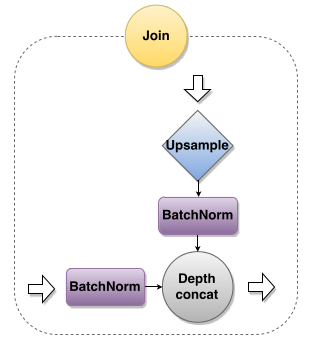
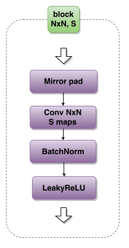
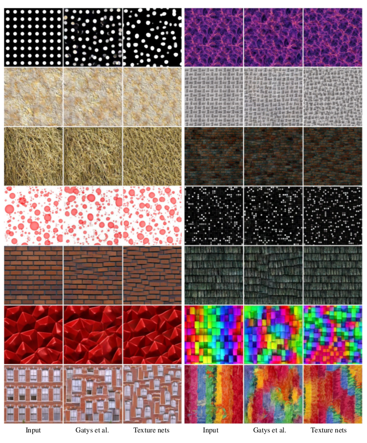
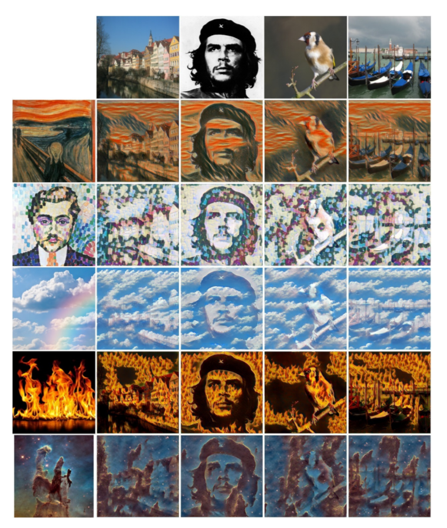

# Information
* Paper: [Texture Networks: Feed-forward Synthesis of Textures and Stylized Images](https://arxiv.org/pdf/1603.03417v1.pdf)
* Author: Dmitry Ulyanov, Vadim Lebedev, Andrea Vedaldi, Victor Lempitsky
* Implementation: [tensorflow](https://github.com/ProofByConstruction/texture-networks)(have not tested yet), [torch](https://github.com/DmitryUlyanov/Texture_Net)
# Summary
* what:
  * They proposed a feed-forward neural network which can generate comparable results when doing texture synthesis and style transfer to the [optimization-based method](A_Neural_Algorithm_of_Artistic_Style.md) proposed by Gatys at al
* how:
  * Two Components: Generator network and Descriptor network
  * Generator network:
    * The basic structure
    * 
    * Join Block
    * 
    * Conv Block
    * 
  * Descriptor network:
    * A pre-trained VGG-16 network on imageNet dataset
    * Texture loss: refer to the style loss in this [paper](A_Neural_Algorithm_of_Artistic_Style.md)
    * Content loss: refer to the content loss in this [paper](A_Neural_Algorithm_of_Artistic_Style.md)
* results:
  * Texture Synthesis
  * 
  * Style Transfer
  * 

* important details:
  * When doing the texture synthesis, the input is only the white noise image. Only texture loss is calculated. While doing the style transfer, the white noise image is concatenated upon content image and both losses are calculated. Also, the number of pyramid height is increased from 5 to 6.
  * The generator network is initialized by Xavier's method.
  * The content loss is computed in relu4_2, and texture loss is computed in relu1_1, relu2_1, relu_3_1, relu4_1, relu5_1
  * Training process settings:
    * Adam
    * learning rate 0.1, reduced by a factor 0.7 for an iteration 1000 and then again for every 200 iterations.
    * Max iteration: 2000
# Page-by-Page walk-through
# Test Results of Chinese Painting Style
