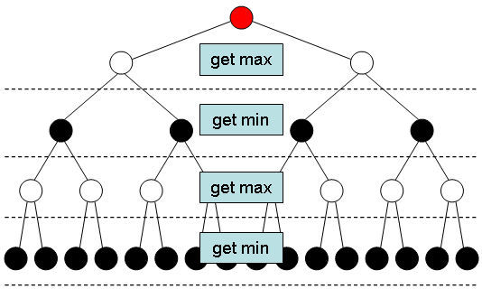
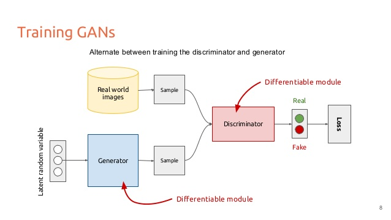
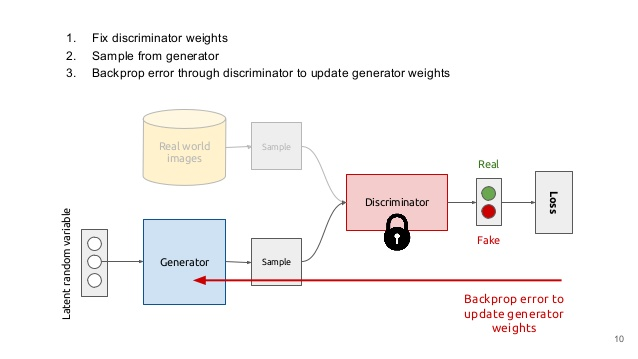
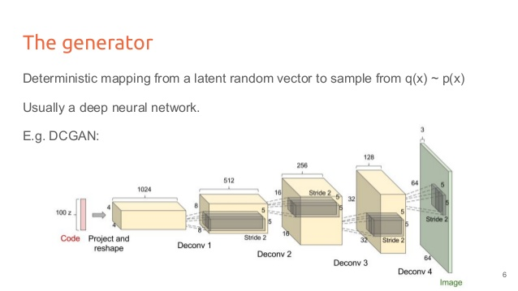

# Generative Adversarial Nets (GAN)

## Papers

- **GAN:** [Generative Adversarial Nets](https://arxiv.org/pdf/1406.2661.pdf) (2014)
- **DCGAN:** [Unsupervised Representation Learning with Deep Convolutional Generative Adversarial Networks](https://arxiv.org/pdf/1511.06434.pdf) (2016)
- **cGAN:** [Image-to-Image Translation with Conditional Adversarial Networks](https://arxiv.org/pdf/1611.07004.pdf) (2016)

## Notes

### Basics

- **Generative** Adversarial Nets
  * Discriminative model: `p(y|x)`
  * Generative model: `p(x,y)`
    * Classify: _Bayes rule_ `p(x,y) -> p(y|x)`
    * Generate: draw samples from `p(x,y)` distribution

- Generative **Adversarial** Nets
  * Generator (fake money maker)
  * Discriminator (police)
  * Game theory
    * Simultaneous Game
    * Sequential Game

  Minimax two-player game

  

### GAN Model Diagram

### Generator Example (DCGAN)

## Other Materials

- [Slides for GAN](https://www.slideshare.net/xavigiro/deep-learning-for-computer-vision-generative-models-and-adversarial-training-upc-2016)
- [pix2pix demo](https://affinelayer.com/pixsrv/)
