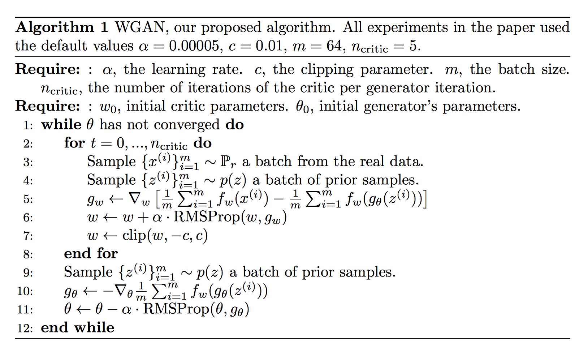
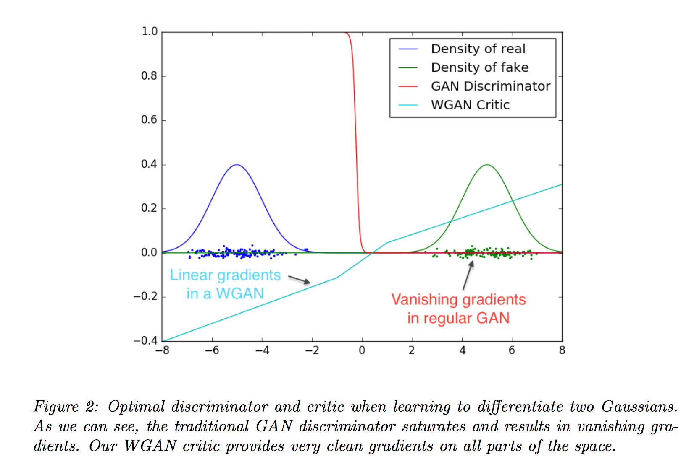
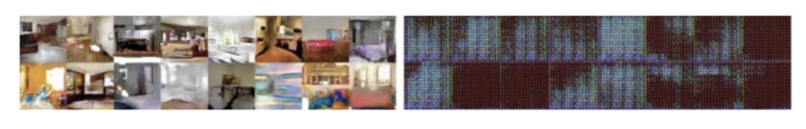
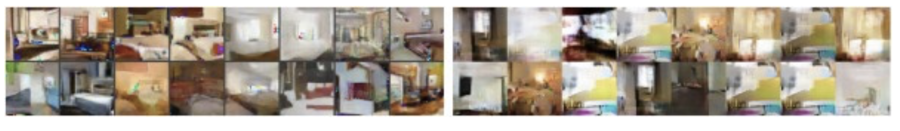
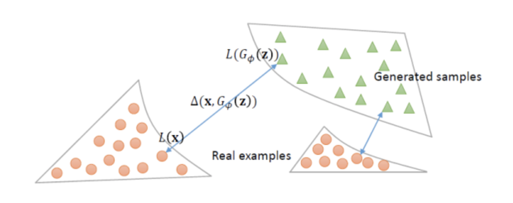
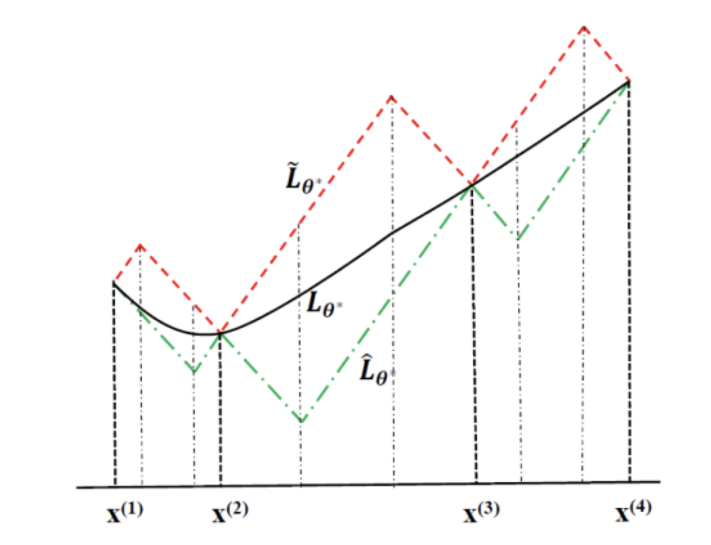
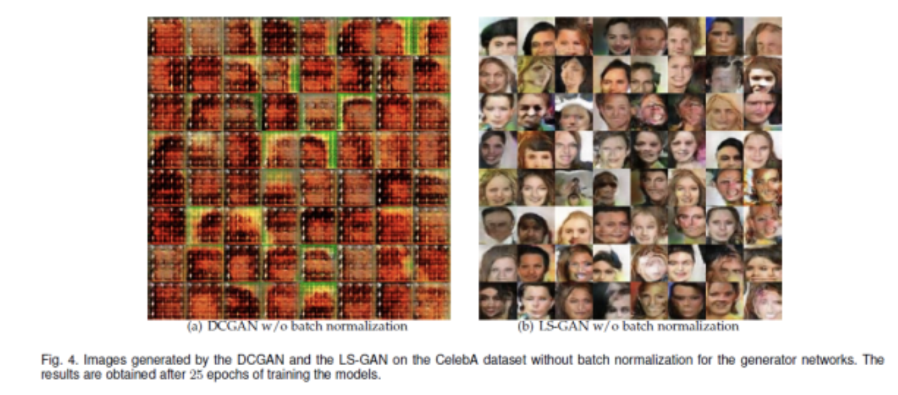

## Wasserstein GAN

WGAN vs DCGAN (without batch normalization): no special tuning needed.

WGAN vs GAN (no CNN): mode collapse fixed

## Loss Sensitive GAN

LS-GAN vs DCGAN (without  batch normalization)

## Readings
- WGAN: https://zhuanlan.zhihu.com/p/25071913
- LS-GAN: https://zhuanlan.zhihu.com/p/25204020
